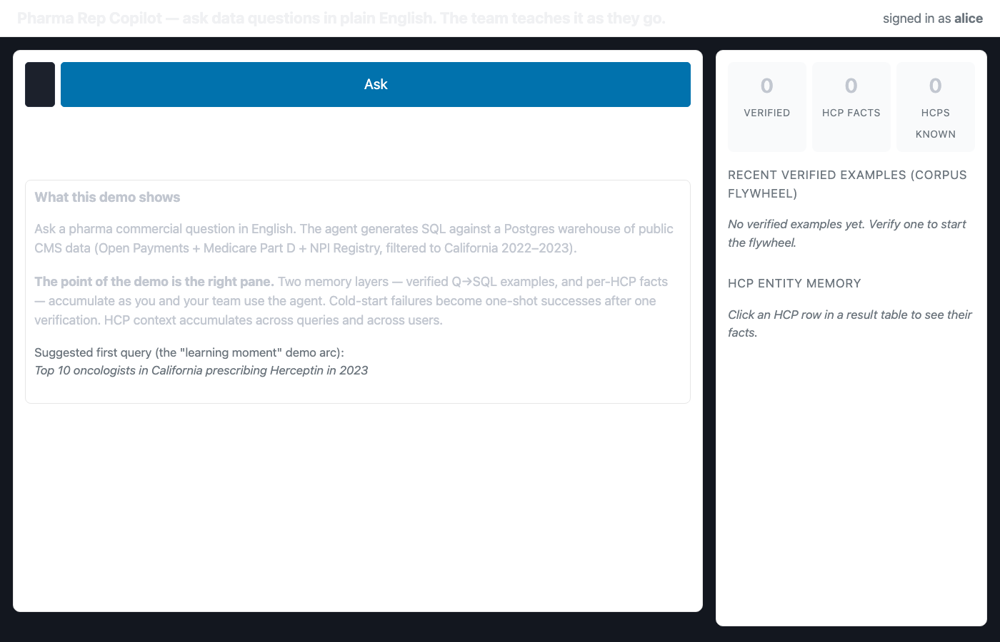
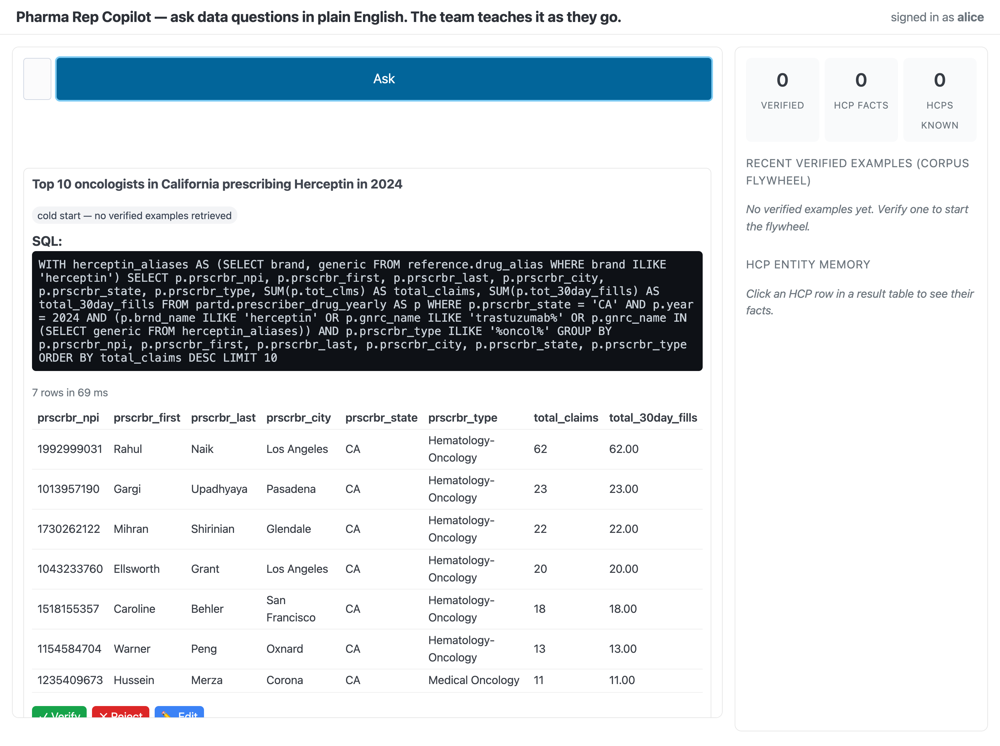
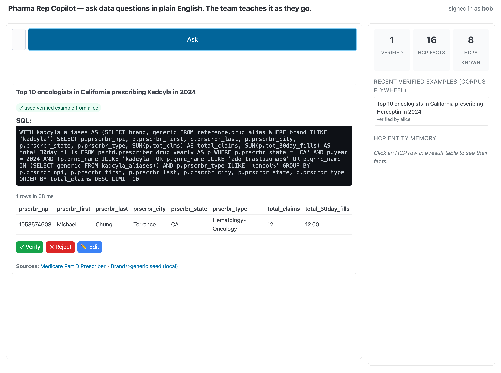
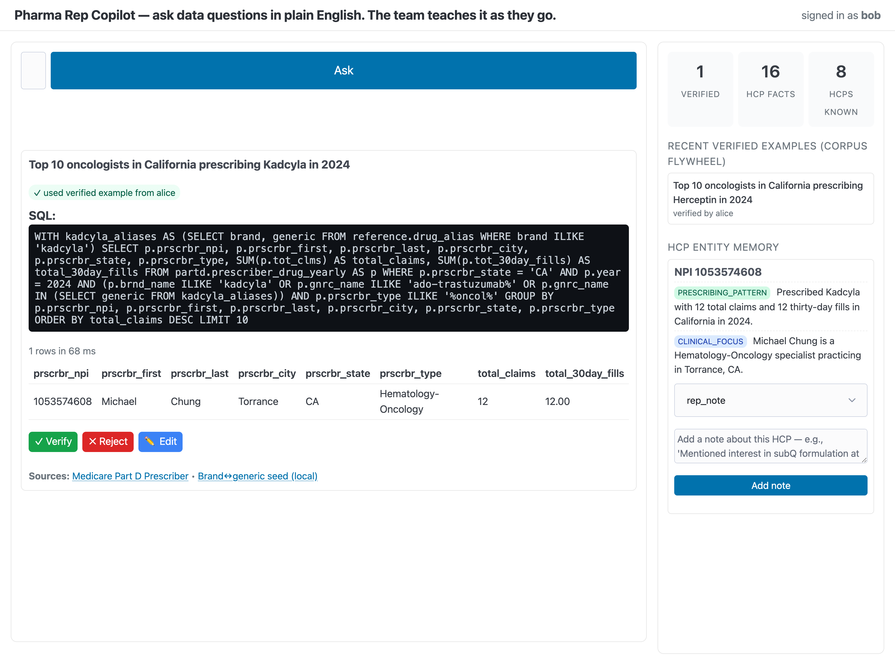
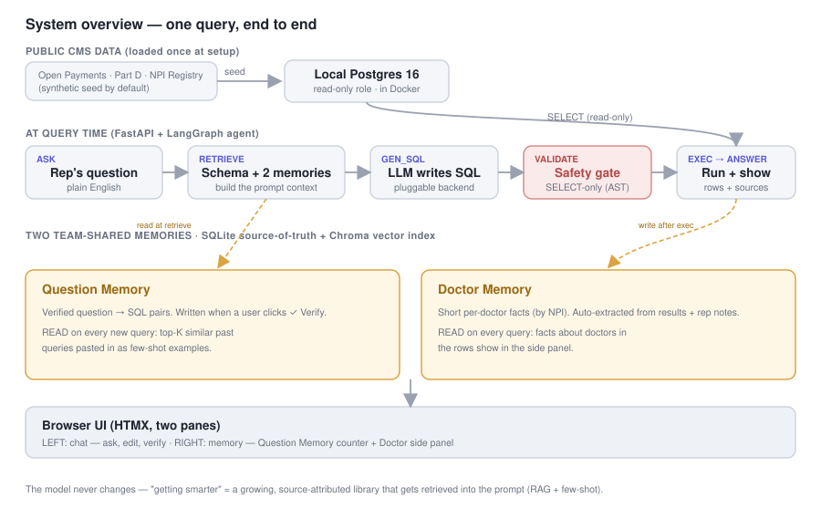
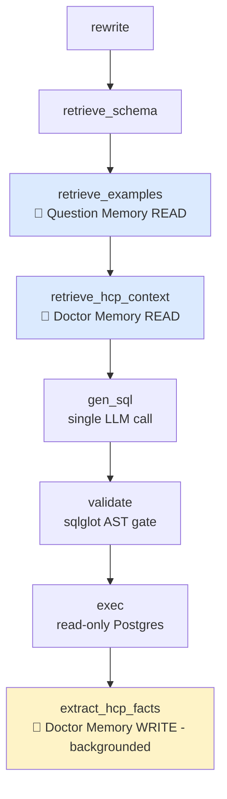

# Pharma Rep Copilot

> **A text-to-SQL copilot for pharma sales reps and medical-affairs teams.** Ask data questions in plain English; get the SQL plus the answer in seconds. The whole team teaches it as they go — every verified query and every note about a doctor becomes shared knowledge that helps the next person.

<!-- TODO: paste demo video link here once recorded -->
<!-- 🎥 **Demo video** — coming soon. -->

[](https://github.com/chennanli/pharma-rep-copilot/actions/workflows/ci.yml)
[](LICENSE)
[](https://www.python.org)
[](https://www.postgresql.org)

## Contents

- [What this is](#what-this-is)
- [Live demo session — actual run, not a mockup](#live-demo-session--actual-run-not-a-mockup)
- [Quickstart — one command](#quickstart--one-command)
- [Data sources — what's in the warehouse](#data-sources--whats-in-the-warehouse)
- [Why memory matters (the principle)](#why-memory-matters-the-principle)
- [How it works](#how-it-works)
- [LLM provider — three choices](#llm-provider--three-choices)
- [All make targets](#all-make-targets)
- [Repo layout](#repo-layout)
- [Roadmap](#roadmap)
- [Acknowledgments](#acknowledgments)
- [License](#license)

---

## What this is

> 📘 **HCP** = Healthcare Professional. In this codebase, "HCP" means doctors (mostly), each identified by their **NPI** = National Provider Identifier (a 10-digit number required for any US clinician who bills Medicare). The whole project is about helping reps work with HCPs.

**Two problems this project solves:**

1. **Non-technical pharma users can't directly query their data warehouses.** Account managers and medical-affairs people file tickets or wait for analysts. Natural-language → SQL fixes that: ask a question in plain English, get back the SQL + result rows + dataset citations in seconds.

2. **LLM tools forget everything between sessions.** Every user starts cold; every correction someone makes today helps no one tomorrow. Two simple kinds of memory fix that — **both serve the same end users (the reps), both are shared across the whole team, both grow automatically as the team uses the tool**:

   - **🧠 Question Memory** — a library of past questions and the SQL that correctly answered them. When you ask something similar to a past question, the agent retrieves that past question + its verified SQL and uses it as a guide. SQL patterns transfer across users.
   - **👤 Doctor Memory** — a per-doctor profile built up automatically from query results, plus free-text notes reps add manually. When a query touches a doctor someone else has already worked with, you see what the team knows about her. Knowledge about individual HCPs compounds across users.

The NL→SQL part is well-trodden ground. The reason this repo exists is to show that **the memory layer actually compounds visibly** when the team is small (10–20 users) and the value per interaction is high.

Both memories are persistent, team-shared, and source-attributed (every fact links back to its **originating query ID** — verified or pending — or a named author). Question Memory entries can be rejected (removed from retrieval); per-fact human verification and deletion for Doctor Memory are on the roadmap.

| Dimension | Value |
|---|---|
| Build dates | 2026-05-29 → 2026-05-31 |
| Lines of code (delta over scaffold) | ~1,800 |
| Infra dependencies | Docker, Postgres, Python 3.12 |
| LLM | Anthropic API **or** local Ollama (free) |
| Data download | Optional — runs on synthetic seed in <1 min |
| Hardware | A laptop |

---

## Status & scope

This is a **working prototype**, built over a weekend to validate one hypothesis: that a team-shared memory layer compounds visibly for a small group of users. It is **not production-ready**, and is intended to run locally as a demo.

Known limitations (and where they're headed):

- **The screenshots below are a real run on real California CMS data** (Medicare Part D 2024 + Open Payments 2023, loaded via `make demo-real`). `make demo` still defaults to a fast synthetic seed for a zero-download demo; the architecture is identical on either.
- **Auto-extracted Doctor Memory facts are unverified drafts.** They are generated by an LLM from query results. They are shown in the side panel for a human to read, but they are **not fed back into the SQL-generation prompt** (only human-entered notes are) — so a model's own draft facts can't silently steer later queries. Per-fact human verification is on the roadmap.
- **Single-user local demo.** User identity is a demo cookie, not real auth; Docker uses fixed dev-only passwords. Do not load real internal data.
- **Memory store is SQLite + Chroma**, which is fine for one user but not for concurrent multi-user load — that's a migration for the production path.
- **The SQL safety gate** (SELECT-only AST gate, rejects data-modifying statements even inside CTEs, a function denylist, and a schema allowlist, with a read-only DB role behind it) is defense-in-depth, not a proof of total safety.
- **Benchmark coverage is scoped to the loaded data.** Only the California-current questions run today; multi-state, multi-year, and trials/drugs questions are split out as roadmap (see [`benchmarks/questions-roadmap.jsonl`](benchmarks/questions-roadmap.jsonl)).

See the [Roadmap](#roadmap) for the planned hardening order.

---

## Live demo session — actual run, not a mockup

Live screenshots of the running UI (headless Chrome, not mockups) on **real California CMS data** — Medicare Part D 2024 + Open Payments 2023, ~159K prescribing rows / ~23K payment rows for CA. Each one shows a meaningful moment.

### Step 1 — Empty state, nothing verified yet



Right pane counters: `0 verified / 0 HCP facts / 0 HCPs known`. Corpus flywheel: *"No verified examples yet."* This is what any new user sees on first launch.

---

### Step 2 — Alice asks Query 1, agent answers, but memory hasn't grown yet (PENDING)

Alice types: *"Top 10 oncologists in California prescribing Herceptin in 2024"*



Notice the **`cold start — no verified examples retrieved`** badge at the top — there's nothing in Question Memory yet for the agent to draw on. Claude generates a clean CTE query JOIN-ing through `reference.drug_alias`. **6 rows returned in ~74 ms**, top prescriber **Rahul Naik (Los Angeles, 62 claims, $313K)** — a real California oncologist. Memory counters in the right pane: still `0 / 0 / 0` because Alice hasn't clicked Verify yet.

---

### Step 3 — Days later, a DIFFERENT rep (Bob) asks a similar question — the agent uses Alice's verified example automatically

Alice's one click on ✓ Verify sent Q1 into Question Memory and triggered the background extractor (atomic facts about the HCPs in her result, into Doctor Memory). Then a different user signed in — **Bob** — and asked: *"Top 10 oncologists in California prescribing Kadcyla in 2024"*



Look at the top right: **"signed in as bob"** (not alice anymore). And the green **`✓ used verified example from alice`** badge at the top of Bob's response — Bob's query automatically retrieved Alice's verified Herceptin Q→SQL as few-shot context. Claude's SQL for Bob's Kadcyla question mirrors the exact CTE structure from Alice's Herceptin query, substituting `KADCYLA` / `TRASTUZUMAB EMTANSINE`. **The pattern Alice taught the system traveled to Bob automatically** — Bob didn't know Alice had verified that query, didn't have to ask, didn't have to look anything up.

Right pane counters: **`1 verified / 16 HCP facts / 8 HCPs known`** — Alice's Q1 is the only verified example, and the background extractor has built facts for the doctors across both queries.

Bob's Kadcyla SQL came back on the first try by reusing the pattern Alice verified, instead of cold-starting from scratch. (Wall-clock latency varies run to run with the LLM, so the point here is the *mechanism* — a verified example removes the next user's cold start — not a specific stopwatch number.)

---

### Step 4 — Bob clicks a doctor — Doctor Memory shows an auto-built profile no rep typed



Right side panel now shows **NPI 1053574608 — Dr. Michael Chung (Torrance, CA)**, a real oncologist from Bob's result. The panel holds facts the system auto-extracted from the query result — **no rep typed any of them**:

| Category | Fact (auto-extracted) |
|---|---|
| `clinical_focus` | Hematology-Oncology specialist practicing in Torrance, CA |
| `prescribing_pattern` | Prescribed Kadcyla (ado-trastuzumab emtansine) 12 times in 2024, total drug cost $58,907 |

This is the team-memory effect at the entity level: every query any rep runs quietly builds and extends per-doctor profiles. Across Alice's and Bob's two queries, Doctor Memory now holds **16 facts across 8 doctors** — all auto-extracted, all visible to whoever asks next. A rep can also click "Add note" to add a free-text, human-verified `rep_note`.

> **Honest scope:** these auto-extracted facts are *drafts* — they show in the panel but are deliberately **not** fed into the SQL-generation prompt (only human notes are). And in this real CA slice no single doctor happened to appear in both the Herceptin and Kadcyla top lists, so the "same doctor, two users" compounding is shown as a *design goal*, not claimed as proven by these specific shots. What these shots **do** prove: Question Memory transfers across users (Step 3), and Doctor Memory auto-builds real profiles (above).

---

### What this proves

| Claim | Evidence |
|---|---|
| Agent generates correct SQL on **real California CMS data** (Part D 2024 + Open Payments 2023) | Screenshots 2 & 3 — SQL visible, real rows returned in tens of ms each |
| Memory grows from team usage | Right pane: `0/0/0` → `1/16/8` between screenshots 1 and 3 |
| **Verified queries help DIFFERENT users (Question Memory crosses user boundaries)** | Screenshot 3: top right shows "signed in as **bob**"; the badge shows `✓ used verified example from alice`. Two different users; cross-user transfer is automatic. |
| Team memory lowers cold-start cost for the next user | Bob's Kadcyla SQL reused Alice's verified Herceptin pattern on the first try instead of cold-starting. (Latency varies run to run; the claim is the mechanism, not a stopwatch number.) |
| Doctor Memory auto-builds real physician profiles | Screenshot 4: Bob clicks Dr. Michael Chung; sees auto-extracted specialty + Kadcyla prescribing — no rep typed them. Across both queries: 16 facts / 8 doctors. |
| Measured on real data (current scope) | 6 California-scoped questions matching the loaded slice. A representative run: **exec 100%, kw 100%** (of questions returning rows), **recall ≈ 50%** (strict "referenced every expected table" — the agent often answers via Part D's own specialty column instead of joining `npi`). Numbers wobble run-to-run with LLM variance. Other states / multi-year / single-HCP-list / trials questions are split to [roadmap](benchmarks/questions-roadmap.jsonl). A smoke diagnostic, **not** a production quality score. |
| Runs through Claude Code subscription, not API key | `.env` has `LLM_PROVIDER=claude_code`; subprocess shells out to local `claude` CLI |

---

## Quickstart — one command

**Pre-requisites:**
- **Python 3.12+** — almost always already present on Mac. If not: `brew install python@3.12`.
- **Docker** — used to run Postgres without you having to install it natively. If you don't have it yet, the project will install OrbStack (lightweight, free) for you with one command (see below).
- **An LLM** — three choices (see [LLM provider](#llm-provider--three-choices)): your Claude Code subscription (no extra cost if you already pay for it), an Anthropic API key, or a free local Ollama install.

```bash
git clone git@github.com:chennanli/pharma-rep-copilot.git
cd pharma-rep-copilot

make install-docker           # only needed if you don't have Docker yet
                              # (does brew install --cask orbstack + launches it)

cp .env.example .env
# edit .env: set ANTHROPIC_API_KEY, or set LLM_PROVIDER=ollama

make demo                     # the actual one-command build + run
```

If anything fails, run `make doctor` — it tells you exactly what's missing and how to fix it.

`make demo` does:

1. Installs `uv` if missing (via Astral installer)
2. Creates a Python 3.12 venv via `uv venv` and installs deps with `uv pip install`
3. `docker compose up -d` (Postgres + app)
4. Waits for Postgres to be healthy
5. Applies `init.sql` (schemas, tables, read-only role)
6. Loads ~500 plausible synthetic HCPs (no CMS download needed)
7. Opens `http://localhost:8080` in your browser

For **real CMS data** instead of synthetic (downloads ~200K rows per dataset for CA via the CMS Data API, ~10–30 min):

```bash
make demo-real
```

---

## Data sources — what's in the warehouse

The project calls **three public US Federal healthcare datasets**, plus one small local lookup table. Each external dataset gets its own Postgres schema and table — **no merging, no cross-source joins at ingest time**. The agent does the joining at query time, the same way an analyst would in a notebook.

> **"Did you mash the data together?"** No — each table is sourced from a single external dataset, with no cross-source joins at ingest. To keep the warehouse small we load a **selected subset of columns** (lowercased, and for Open Payments a few renamed to short names — see the `WANTED`/`COL_MAP` maps in `scripts/ingest_*.py`), not a byte-for-byte copy of the CMS CSV. The column meanings mirror the CMS originals; the set is a subset.

| Postgres table | Source dataset (column subset) | What each row represents | Approx size (CA only) |
|---|---|---|---|
| `payments.general_payments` | [**CMS Open Payments — General Payments**](https://www.cms.gov/openpayments) | One industry-to-HCP payment record (a consulting fee, a meal, a travel reimbursement). Federal law requires every US drug & device company to report these. | ~500K rows / year |
| `partd.prescriber_drug_yearly` | [**CMS Medicare Part D — Prescribers by Provider and Drug**](https://data.cms.gov/provider-summary-by-type-of-service/medicare-part-d-prescribers/medicare-part-d-prescribers-by-provider-and-drug) | One row per (prescriber × drug × year): how many claims, total cost, day supply. | ~1M rows / year |
| `npi.npi_registry` | [**NPPES NPI Registry**](https://npiregistry.cms.hhs.gov/) — **but derived** from `partd` distinct NPIs in this demo (see note below) | One row per HCP: NPI number, name, city, state, specialty | ~250K HCPs |
| `reference.drug_alias` | **Local seed** in `scripts/seed_drug_alias.py` (hand-curated, ~17 rows) | Brand → generic name mapping (Herceptin → TRASTUZUMAB, etc.) | ~17 rows |

> ⚠️ **About the NPI table being "derived":** The official NPPES NPI Registry is a 7 GB monthly file with all ~7 million US clinicians. For a CA-only demo, downloading that is overkill. Instead, `scripts/derive_npi_registry.py` builds the `npi.npi_registry` table by selecting distinct NPIs from `partd` and pulling per-NPI fields (first name, last name, city, state, specialty) that Part D already includes. This is the only place data is "synthesized" from another table. If you want the real NPI Registry instead, swap `derive_npi_registry.py` for an NPPES file ingest — the schema stays identical.

All external sources are **public domain US Federal data**. No auth required. No usage limits. **No PHI** — patient-level data is not in scope and the schema deliberately cannot represent it.

### Two ways the data gets in

| Path | Command | What it loads | Time |
|---|---|---|---|
| **Synthetic** (default for `make demo`) | `make seed-synth` | ~500 fabricated HCPs + Part D rows + Open Payments rows. Plausible but invented. | ~10 sec |
| **Real CMS** (for `make demo-real`) | `make seed-real` | Real California rows pulled from the CMS Data API. | ~10–30 min |

The synthetic path is the default because (a) the architecture works identically on either, (b) downloads aren't bottlenecking a demo, and (c) the data is small enough to keep the database snappy. Real CMS is one command away if you need it.

### Check what's currently loaded

```bash
make data-status
```

Shows row counts in all four warehouse tables plus the memory store (verified examples + HCP facts). Tells you at a glance whether the database is empty, populated with synth, or populated with real CMS.

---

## Why memory matters (the principle)

> The single most important thing to understand about this project. Everything else is implementation detail.

### The starting fact: LLMs are stateless

Every call to Claude (or any LLM) starts from zero. The model has no memory of who you are, what you asked yesterday, what worked last week, or what your colleague figured out. Each session is a clean slate.

For consumer chat that's fine. For a tool an organization uses repeatedly to do high-value work, it's a serious problem:
- Every user re-learns the same lessons
- Every cold start is a tax
- Every correction someone makes today benefits no one tomorrow

> [!NOTE]
> **The pattern this addresses.** A common complaint about internal LLM tools: *"It doesn't get smarter — every session starts cold."* That's not a UI bug. It's the inherent property of LLM apps that don't have a memory layer. The fix isn't a better prompt; it's adding the layer that survives between sessions.

### The two memories explained

This project has **two distinct memories**, and confusing them is the #1 thing people get wrong about the architecture. They serve the same end users (the reps), but they remember different things.

| | 🧠 Question Memory | 👤 Doctor Memory |
|---|---|---|
| **What it stores** | Whole question + SQL pairs that were verified to work | Atomic facts about individual HCPs (NPI + 1 sentence per fact) |
| **Captures** | "What worked" (the query pattern) | "Who we know" (specific doctors) |
| **Write trigger** | A user clicks ✓ Verify after a successful query | Auto-extracted from result rows after every successful query, plus free-text notes reps type manually |
| **Read trigger** | Every new question — top-K similar past questions are pulled into the prompt as few-shot context | Every new query result — facts about HCPs in the rows are surfaced in the side panel |
| **Effect** | SQL patterns transfer across users (Alice's verified SQL helps Bob next week) | Knowledge about specific physicians compounds across users (Alice's note about Dr. Chen helps Bob next week) |

### Why both? Why not just one?

- **Question Memory alone** makes the SQL agent smarter, but not the field organization. Reps don't ask the same question twice; they ask structurally similar questions about different drugs or territories. Question Memory handles that.
- **Doctor Memory alone** builds a sophisticated CRM-lite, but every SQL generation still starts cold. Reps would still have to manually compose queries every time.

Together: Alice corrects one SQL pattern (Question Memory captures it). Her query returns rows about 10 doctors (Doctor Memory captures their facts). A week later Bob's structurally similar query benefits from *both* — Alice's pattern AND the fact that one of his doctors is already partially known to the system.

### The walk-through: Day 1, Day 7, Day 30

> ⚠️ **This is a hypothetical future scenario** illustrating how the memory layer is *intended* to compound with sustained team use (including a same-doctor-across-users case). It is not a transcript of the screenshots above — the live run on the current CA data slice proves cross-user *Question* Memory and automatic *Doctor* profile-building, but did not happen to surface one doctor across both users. Names like "Dr. Chen" here are illustrative.

> 🔴 **Day 1** — Alice asks a Herceptin question. Returns 0 rows.
>
> *Cold start. The system has never been used.*
>
> Alice asks "Top 10 oncologists in California prescribing Herceptin in 2024." Claude generates SQL with `WHERE drug_name = 'HERCEPTIN'` and gets zero rows back. Why? Medicare Part D stores generic names — TRASTUZUMAB. A textbook pharma data trap. The agent didn't know because nothing in the schema or the prompt told it. **No knowledge has been captured yet.**

> 🟢 **Day 1, two minutes later** — Alice fixes it.
>
> *First verification event. The flywheel begins.*
>
> Alice edits the SQL to JOIN through `reference.drug_alias` (brand → generic) and clicks ✓ Verify. The corrected query becomes Item #1 in the team's verified-examples store. The 10-row result triggers the HCP fact extractor — 20 facts written, one prescribing_pattern and one clinical_focus per HCP. **The system just learned something the whole team will benefit from.**

> 🔵 **Day 1, evening** — Alice adds a note about Dr. Chen.
>
> *First free-text rep note. Entity memory becomes "field-knowledge-shaped."*
>
> Alice clicks Dr. Chen's row, types: *"Mentioned interest in subQ formulation at conference dinner — follow up on Roche side."* Categorized as `rep_note`, attached to Dr. Chen's NPI, author = alice. This is the kind of knowledge that today lives in someone's notebook and dies when they switch territories. Now it lives in the shared store, traceable.

> 🟢 **Day 7** — Bob asks a Kadcyla question. First-try success.
>
> *Question Memory fires. SQL pattern transferred across users.*
>
> Bob, a different rep, asks "Top 10 oncologists in California prescribing Kadcyla in 2024." The agent's `retrieve_examples` step finds Alice's verified Herceptin query — similarity 0.85 — and pulls it into the prompt. The generated SQL correctly JOINs through `reference.drug_alias` on its first attempt. Provenance badge in the UI: ✓ used verified example from alice. Bob has no idea this needed any help; from his perspective it just worked.

> 🔵 **Day 7, Bob clicks Dr. Chen.**
>
> *Doctor Memory fires. Knowledge about a specific HCP travels across users.*
>
> Dr. Chen appears in Bob's Kadcyla result too (HER2+ breast oncologists prescribe both). Bob clicks her row. The side panel shows everything the team knows: Alice's prescribing-pattern fact, Alice's rep_note about the conference conversation, the freshly-extracted Kadcyla fact, plus her clinical focus and affiliation. **Bob has never met Dr. Chen. He walks into his next call with two weeks of team context.**

> 🟢 **Day 30** — 10 reps, ~150 verified queries, ~3,000 HCP facts.
>
> *The compounding effect is now visible.*
>
> New questions are answered correctly first try the majority of the time, because most structural patterns the team needs have been verified once. New reps onboard by asking questions and immediately benefiting. The system has gotten genuinely smarter — not because anyone trained a model, but because every interaction left a verified knowledge artifact behind.

### Why this matters MORE for a 10–20 user product than for a 10,000-user product

Counter-intuitive but true. The compounding-knowledge effect of team memory scales super-linearly with the **value per interaction**, not with the number of users.

- Consumer chat (millions of users, low value per interaction): memory matters but ROI is incremental. Each interaction is cheap to lose.
- Pharma field organization (10–20 users, very high value per interaction — every call can swing a six- or seven-figure account): memory matters enormously. Losing one rep's Friday morning correction means nine other reps fail the same way next Friday.

The 10-user product is the **perfect** place to invest in a memory layer.

---

## How it works

### System overview



**How to read this:**
- Public CMS data flows in **once** during setup (top → middle).
- During a live query, the agent reads from Postgres (with a read-only role) and from team memory, generates SQL, and writes new memory artifacts on the way out.
- The UI is intentionally thin — it's a server-rendered HTMX shell, no JavaScript framework.

### The 8-node agent graph

Each query flows through 8 nodes in order. The three nodes that touch memory are marked.



### Storage layout

Each memory has two copies: a structured SQLite table (the source of truth, used for audit and `SELECT *` queries) plus a Chroma vector collection (used for similarity retrieval at query time). Writes go to both, synchronously.

| Memory | Structured (source of truth) | Vector index (for retrieval) |
|---|---|---|
| **🧠 Question Memory** | SQLite `sql_examples` table — one row per Q→SQL pair with status (PENDING/VERIFIED/REJECTED), author, timestamp | Chroma `sql_examples` collection — embeds the question text for "find similar past questions" |
| **👤 Doctor Memory** | SQLite `hcp_facts` table — one row per fact, keyed by NPI, with category (clinical_focus / prescribing_pattern / payment_history / rep_note / affiliation), author, source query ID | Chroma `hcp_memory` collection — embeds each fact's text for semantic recall when the same doctor appears in a new query |

### Safety — three layers, defense in depth

1. **Database role.** The agent connects as `hcp_agent_ro` with `SELECT`-only privilege. No `INSERT`, no `UPDATE`, no `DDL`. Even if every other layer fails, Postgres refuses writes.
2. **AST gate.** Every candidate SQL passes through `app/sql_safety.py` which uses sqlglot to reject non-SELECT statements, multi-statement payloads, bind placeholders, and queries that would expose individual HCP identities without aggregation.
3. **Traceability.** Every query is persisted to the `sql_examples` table (question, SQL, author, timestamp) the moment it runs, and every memory write is timestamped and source-attributed (author or originating query ID). A dedicated execution audit log with result row counts is on the roadmap.

### Why HTMX instead of React

FastAPI + HTMX + pico.css. ~250 lines of templates, ~80 lines of CSS, ~150 lines of FastAPI. Zero npm, zero build step, zero state-management library. Every interaction is a server-rendered fragment swap. This is intentional — it's a demo, not a product. When the demo becomes a product, the React rewrite is a 1-week project, and at that point you'll know exactly what to build because the HTMX version already proves the UX.

---

## LLM provider — three choices

Pick one based on what you already have.

### Option A — Claude Code subscription (recommended if you already pay for it)

If you already pay for a Claude Code monthly subscription, this option costs you nothing extra. The app shells out to your local `claude` CLI as a subprocess; every call uses your subscription's auth, not an API key.

```bash
# in .env
LLM_PROVIDER=claude_code
```

Requires the `claude` CLI installed and signed in:
- Install: https://docs.anthropic.com/en/docs/claude-code
- Verify: `claude --version` (must work in your terminal)

**Tradeoffs:** ~1 second extra per call (subprocess overhead); subject to your subscription's rate limits (5-hour message windows).

### Option B — Anthropic API (pay-per-token, fastest)

```bash
# in .env
LLM_PROVIDER=anthropic
ANTHROPIC_API_KEY=sk-ant-...
ANTHROPIC_MODEL=claude-sonnet-4-6
```

Fastest and best quality. You pay per token — running the full synthetic demo arc costs roughly $0.10.

### Option C — Ollama (free, runs locally on your laptop)

```bash
# Install once: https://ollama.com
ollama serve &
ollama pull qwen2.5-coder:7b   # ~4GB. Best NL→SQL among small open models.

# in .env
LLM_PROVIDER=ollama
OLLAMA_HOST=http://localhost:11434
OLLAMA_MODEL=qwen2.5-coder:7b
# (when running app in Docker, use http://host.docker.internal:11434)
```

Free. No API key, no subscription. SQL quality is lower than Claude but fine for the synthetic demo data.

---

## All make targets

```bash
make demo         # one-click: setup + docker up + synth seed + open browser
make demo-real    # same but with real CMS data (API download, ~10 min)

# Building blocks (compose your own flow):
make setup        # install uv + create venv + install deps + create .env
make up           # docker compose up -d (Postgres + app)
make down         # stop containers (keeps Postgres volume + memory data)
make logs         # tail app logs
make data-status  # show row counts in warehouse + memory store
make db-init      # apply schemas / tables / read-only role
make seed-synth   # load ~500 HCPs of plausible synthetic data
make seed-real    # download CA CMS data + ingest (~10 min)
make run          # start uvicorn locally (no docker — for hot reload)
make open         # open the UI in default browser
make clean        # stop + wipe volumes (DESTRUCTIVE)
make reset        # clean then setup again
```

---

## Repo layout

```
pharma-rep-copilot/
├── Makefile               # all common workflows
├── Dockerfile             # app container
├── docker-compose.yml     # Postgres + app
├── README.md              # this file
├── LICENSE                # PolyForm Noncommercial 1.0.0
├── docs/
│   ├── architecture.md    # long-form architecture
│   ├── data-sources.md    # CMS datasets used
│   └── safety.md          # the 3-layer safety design
├── app/
│   ├── main.py            # FastAPI + HTMX entry
│   ├── agent_graph.py     # 8-node LangGraph
│   ├── memory_store.py    # SQLite + Chroma — two memory layers
│   ├── hcp_extractor.py   # LLM fact extractor
│   ├── llm_client.py      # Anthropic / Ollama abstraction
│   ├── sql_safety.py      # sqlglot AST gate
│   ├── pg_runner.py       # read-only Postgres
│   ├── schema_introspect.py
│   ├── prompts.py
│   ├── cli.py
│   ├── templates/         # HTMX HTML fragments
│   └── static/style.css
├── scripts/
│   ├── entrypoint.sh      # docker entrypoint
│   ├── init.sql           # DDL applied on first run
│   ├── setup_postgres.sh  # alt for non-docker dev
│   ├── synth_seed.py      # synthetic data (no download)
│   ├── download_cms_via_api.py
│   ├── ingest_part_d.py
│   ├── ingest_open_payments.py
│   ├── derive_npi_registry.py
│   ├── seed_drug_alias.py
│   ├── setup_data.sh      # manual download orchestrator
│   ├── generate_voiceover.py
│   └── run_benchmark.py
├── benchmarks/questions.jsonl   # 6 current-scope eval questions (+ 24 in questions-roadmap.jsonl)
└── data/                  # gitignored: CSVs + memory.db + chroma/
```

---

## Roadmap

Not in this weekend, but logical next steps:

- Per-rep scoping on top of team-shared memory (some facts are private to a rep)
- ClinicalTrials.gov + PubMed enrichment of HCP profiles
- LanceDB substrate when corpus crosses ~10K examples
- Add decay + tiered storage to the memory layer when it crosses ~50K facts (current simple approach is fine below that)
- MLR audit dashboard (read view of SQLite tables, filterable by source + author)
- Slack / Teams entry point alongside the web UI

---

## Acknowledgments

Thanks to **Jiyong Chen** and **Qin Chao** for the conversations and shared learning that shaped how I think about production text-to-SQL and team-memory design. The good ideas here have their fingerprints on them; the rough edges are mine alone.

---

## License

[**PolyForm Noncommercial 1.0.0**](LICENSE) — free for personal projects, research, education, hobby, academic work, charities, and government use. **Commercial use requires a separate license** — contact chennanli@gmail.com.
